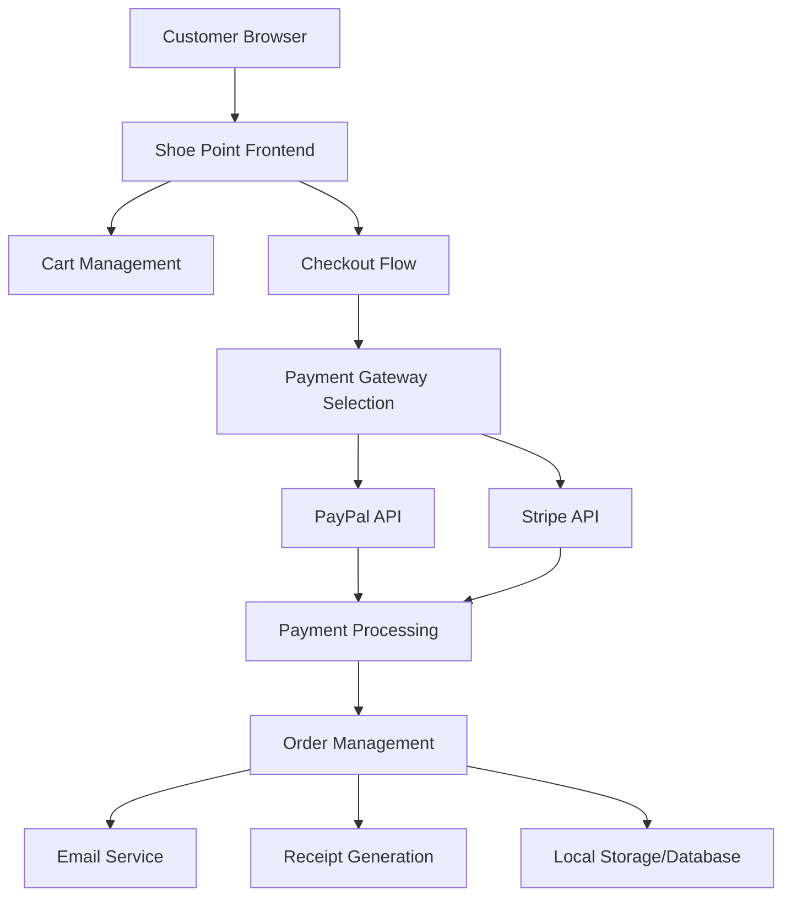
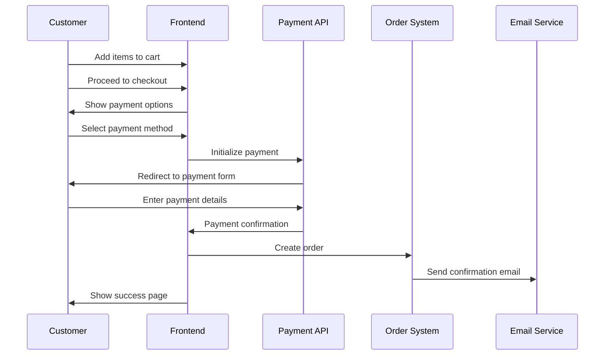

# Payment Integration Design Document

## Overview

This design document outlines the implementation of a secure payment processing system for Shoe Point using PayPal and Stripe APIs. The system will handle the complete payment flow from cart management to order fulfillment, ensuring security, reliability, and excellent user experience.

## Architecture

### High-Level Architecture



### Payment Flow Architecture



## Components and Interfaces

### 1. Cart Management System

**Purpose:** Handle shopping cart operations and persistence

**Key Functions:**
- `addToCart(productId, quantity, price)`
- `removeFromCart(productId)`
- `updateQuantity(productId, newQuantity)`
- `calculateTotal()`
- `persistCart()` - Save to localStorage
- `loadCart()` - Load from localStorage

**Data Structure:**
```javascript
const cart = {
    items: [
        {
            id: 'product-id',
            name: 'Product Name',
            price: 5500,
            quantity: 2,
            image: 'product-image.webp'
        }
    ],
    subtotal: 11000,
    shipping: 0,
    tax: 1100,
    total: 12100,
    timestamp: '2024-01-01T00:00:00Z'
}
```

### 2. Payment Gateway Integration

#### PayPal Integration
- **API:** PayPal JavaScript SDK v4
- **Environment:** Sandbox for testing, Live for production
- **Flow:** PayPal Checkout with Smart Payment Buttons

```javascript
// PayPal Configuration
const paypalConfig = {
    clientId: 'YOUR_PAYPAL_CLIENT_ID',
    currency: 'PKR',
    intent: 'capture',
    environment: 'sandbox' // or 'production'
}
```

#### Stripe Integration
- **API:** Stripe.js v3
- **Components:** Stripe Elements for secure card input
- **Flow:** Payment Intents API for card processing

```javascript
// Stripe Configuration
const stripeConfig = {
    publishableKey: 'pk_test_...',
    currency: 'pkr',
    paymentMethodTypes: ['card']
}
```

### 3. Order Management System

**Purpose:** Handle order creation, tracking, and management

**Order Data Model:**
```javascript
const order = {
    orderId: 'SP-2024-001',
    customerId: 'customer-uuid',
    customerInfo: {
        name: 'Customer Name',
        email: 'customer@email.com',
        phone: '+92-xxx-xxxxxxx',
        address: {
            street: 'Street Address',
            city: 'Muzaffarabad',
            state: 'AJK',
            postalCode: '13100',
            country: 'Pakistan'
        }
    },
    items: [...], // Cart items
    payment: {
        method: 'paypal', // or 'stripe'
        transactionId: 'txn_123456',
        amount: 12100,
        currency: 'PKR',
        status: 'completed'
    },
    shipping: {
        method: 'standard',
        cost: 0,
        estimatedDelivery: '2024-01-05'
    },
    status: 'confirmed', // pending, confirmed, processing, shipped, delivered
    createdAt: '2024-01-01T00:00:00Z',
    updatedAt: '2024-01-01T00:00:00Z'
}
```

### 4. Receipt Generation System

**Purpose:** Generate PDF receipts and email confirmations

**Technologies:**
- **PDF Generation:** jsPDF library
- **Email Service:** EmailJS for client-side email sending
- **Template Engine:** HTML templates with dynamic data injection

**Receipt Template Structure:**
- Store header with logo and contact info
- Order details (ID, date, customer info)
- Itemized list with prices
- Payment summary (subtotal, shipping, tax, total)
- Payment method and transaction ID
- Footer with return policy and contact info

## Data Models

### Customer Data Model
```javascript
const customer = {
    id: 'uuid',
    name: 'string',
    email: 'string',
    phone: 'string',
    addresses: [
        {
            type: 'shipping', // or 'billing'
            street: 'string',
            city: 'string',
            state: 'string',
            postalCode: 'string',
            country: 'string',
            isDefault: boolean
        }
    ],
    createdAt: 'timestamp'
}
```

### Product Data Model
```javascript
const product = {
    id: 'string',
    name: 'string',
    price: number,
    category: 'string', // running, basketball, soccer, tennis, hiking
    image: 'string',
    description: 'string',
    sizes: ['7', '8', '9', '10', '11'],
    inStock: boolean,
    stockQuantity: number
}
```

## Error Handling

### Payment Error Categories

1. **Network Errors**
   - Connection timeout
   - API unavailable
   - Rate limiting

2. **Payment Errors**
   - Card declined
   - Insufficient funds
   - Invalid card details
   - Expired card

3. **System Errors**
   - Invalid order data
   - Duplicate transaction
   - Server errors

### Error Handling Strategy

```javascript
const errorHandler = {
    handlePaymentError(error) {
        switch(error.type) {
            case 'card_error':
                return 'Your card was declined. Please try a different card.';
            case 'network_error':
                return 'Network error. Please check your connection and try again.';
            case 'api_error':
                return 'Payment service temporarily unavailable. Please try again later.';
            default:
                return 'An unexpected error occurred. Please try again.';
        }
    },
    
    logError(error, context) {
        console.error('Payment Error:', {
            error: error.message,
            context,
            timestamp: new Date().toISOString()
        });
    }
}
```

## Testing Strategy

### Unit Testing
- Cart operations (add, remove, update, calculate)
- Payment form validation
- Order data creation and validation
- Receipt generation functions

### Integration Testing
- PayPal payment flow (sandbox)
- Stripe payment flow (test mode)
- Email delivery testing
- Order creation and storage

### End-to-End Testing
- Complete purchase flow from cart to confirmation
- Payment failure scenarios
- Receipt generation and email delivery
- Mobile responsiveness testing

### Security Testing
- API key protection
- HTTPS enforcement
- Input validation and sanitization
- XSS and CSRF protection

## Security Considerations

### API Key Management
- Store API keys in environment variables
- Use different keys for development/production
- Implement key rotation strategy
- Never expose secret keys in client-side code

### Data Protection
- Use HTTPS for all payment-related requests
- Implement Content Security Policy (CSP)
- Validate and sanitize all user inputs
- Use secure session management

### PCI Compliance
- Never store card data locally
- Use tokenization for recurring payments
- Implement proper logging without sensitive data
- Regular security audits and updates

## Performance Optimization

### Frontend Optimization
- Lazy load payment scripts
- Implement loading states for better UX
- Cache cart data in localStorage
- Optimize images and assets

### API Optimization
- Implement request debouncing
- Use connection pooling
- Implement retry logic with exponential backoff
- Monitor API response times

## Deployment Considerations

### Environment Setup
- Development: Use sandbox/test APIs
- Staging: Mirror production with test data
- Production: Use live APIs with proper monitoring

### Configuration Management
```javascript
const config = {
    development: {
        paypal: {
            clientId: 'sandbox_client_id',
            environment: 'sandbox'
        },
        stripe: {
            publishableKey: 'pk_test_...'
        }
    },
    production: {
        paypal: {
            clientId: 'live_client_id',
            environment: 'production'
        },
        stripe: {
            publishableKey: 'pk_live_...'
        }
    }
}
```

### Monitoring and Analytics
- Track payment success/failure rates
- Monitor API response times
- Log transaction volumes
- Set up alerts for payment failures
- Implement user behavior analytics

This design provides a comprehensive foundation for implementing secure, reliable payment processing that meets all the specified requirements while ensuring excellent user experience and maintainability.